This is the respository which host the source code, 3D models and schematics for Socavabot combat robot.

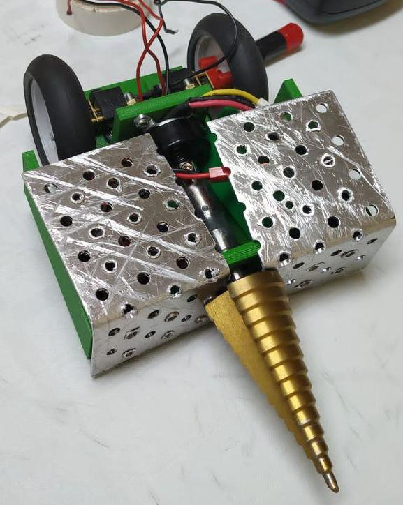
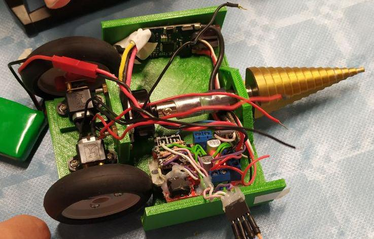

## Parts
| Name               |      Dimensions     | Weight | Image         |
| ------------------ |:-------------------:|:------:| -------------:|
| ESP-12             |  24x16 mm           |        |  |
| Generic Wheel      |                     |        | 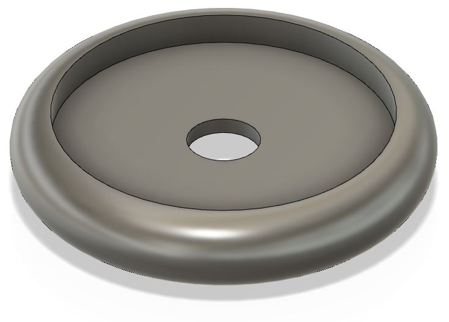 |
| Wheel Hub          |                     |        | 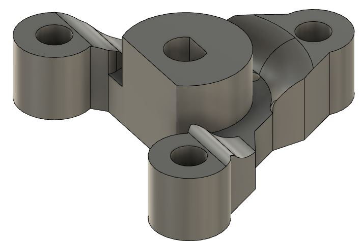 |
| Pololu Micro Motor |   35x12x10 mm       |        | 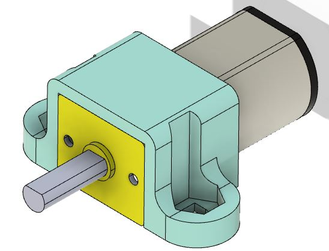 |
| L298N H-Bridge     |    50x52 mm         |        | 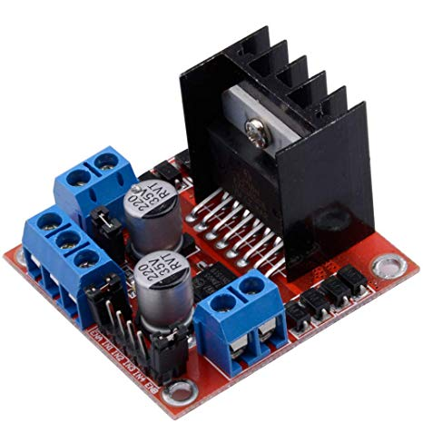 |
| Li-Po Battery      |  60x30x15 mm        |        | 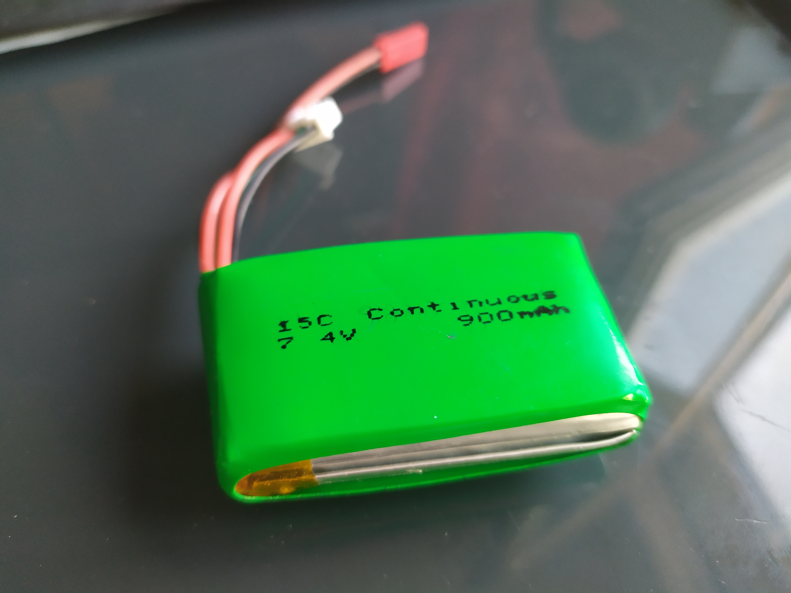 |
| Brushless Motor    |                     |        | 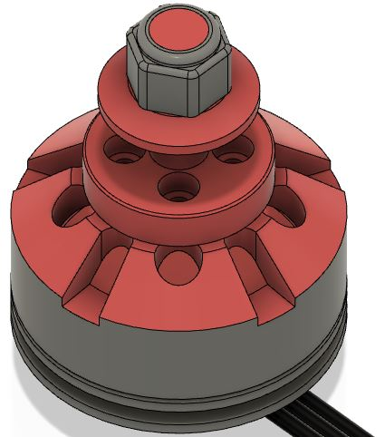 |
| 3D printed chassis | D: 170 mm, H: 60 mm |        | 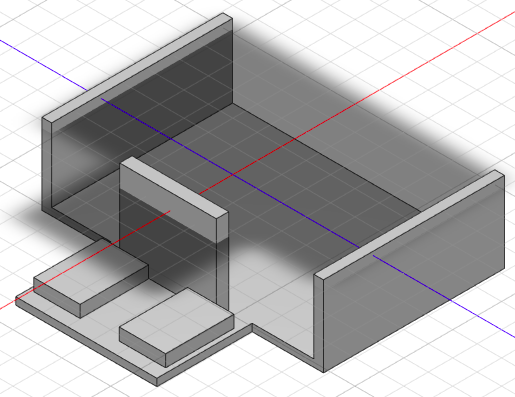 |
| Metal Sheets       |                     |        |               |

## 3D Model Design

For the `chassis` and the `wheel hub` were applied topology optimization techniques in order to reduce mass:

### Wheel Hub

Original Design:  
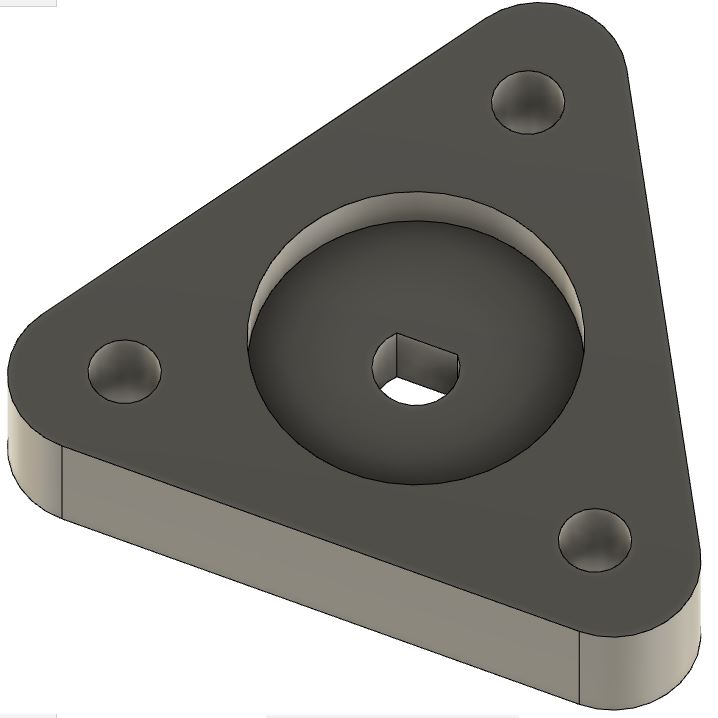

Stress Analysis:  
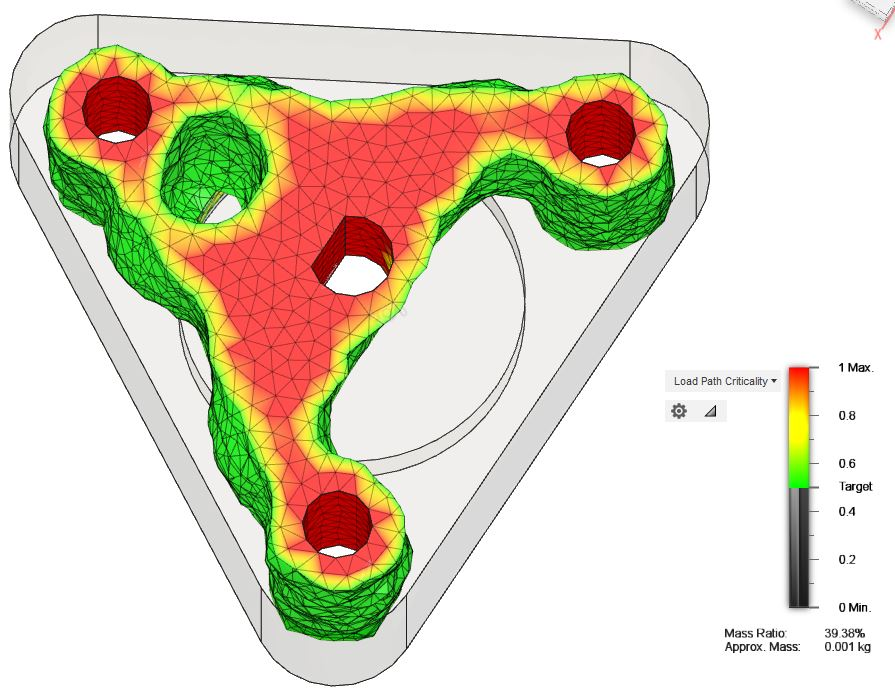

Optimized Design (Mass reduction 80%):  
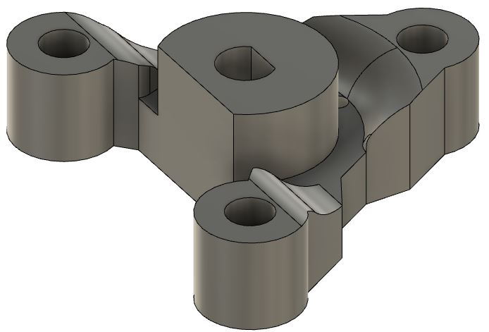

### Assemble

## Schematics
The connections between the motors, ESP-12 and H-bridge:  

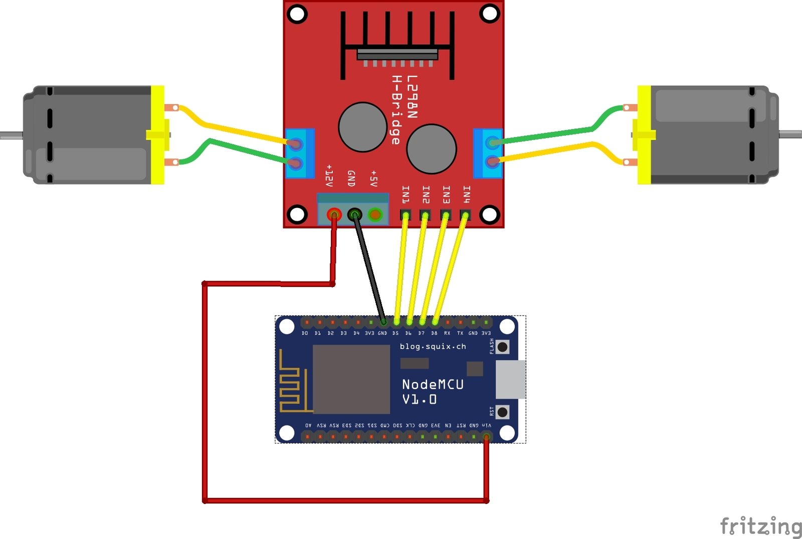